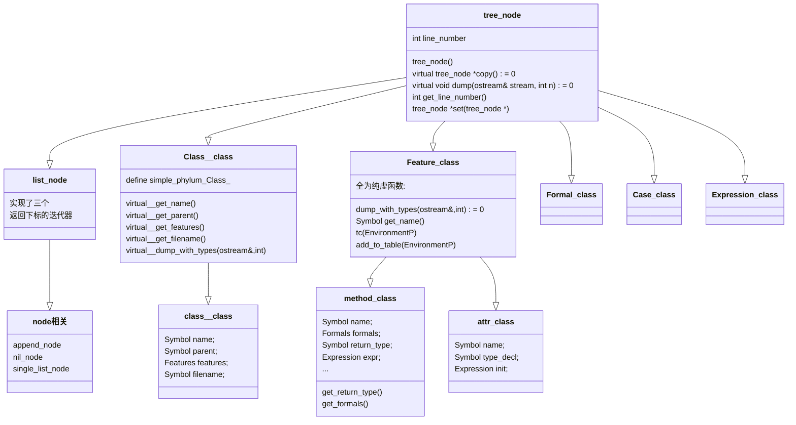
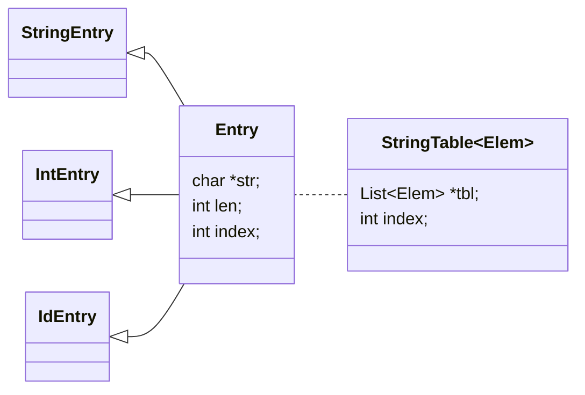
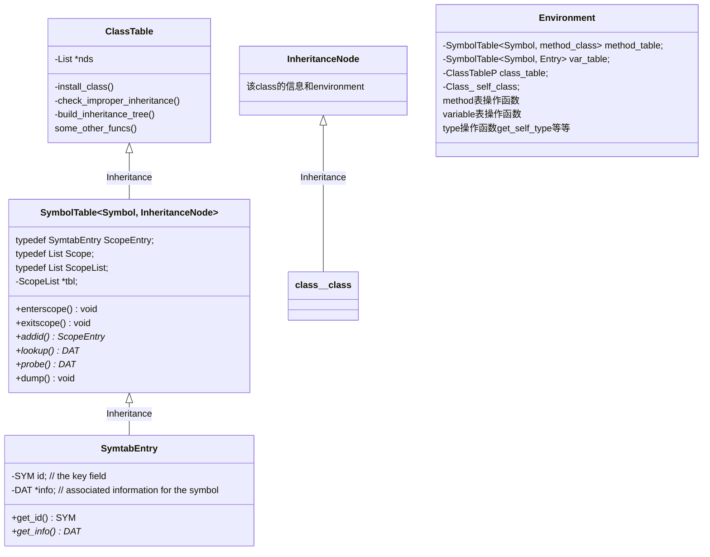

# COMPLIER-CS143

这篇文章所用到的代码结构其实复杂了一些, 看到个其他的解法

## 0. 预备知识 

### COOL语言

- 只能说是比较复杂, manuals和源码分析详见相关文档
- 比较典型的是继承树结构

```c++
          { -> [String]
          { -> [Int]
[OBJECT] ={ -> [IO]     -> [B]
          { -> [Bool]
          { -> [A]
```

### 编译原理

- 词法分析->语法分析->语义分析
-  
- **词法分析** 
  - 从左向右逐行扫描源程序的字符，识别出各个单词，确定单词的类型。将识别出的单词转换成统一的机内表示——词法单元(**token**)形式
- **语法分析** 
  - 语法分析器(parser)从词法分析器输出的token序列中识别出各类短语，并构造语法分析树(**parse tree**)
- **语义分析** 
  - 收集标识符的属性信息&&语义检查
- **中间代码** 
  - 三地址码 (Three-address Code)
    	三地址码由类似于汇编语言的指令序列组成，每个指令最多有三个操作数(operand)
  - 语法结构树/语法树 (Syntax Trees)

### CS143实验文件结构

#### list.h:

- 注意到head是这个节点存储的数据, 而tail指向下一个节点, 构造节点时在这一串链表的头部添加新的节点. 

```c++
template <class T>
class List {
private:
  T *head;
  List<T>* tail;
public:
  List(T *h,List<T>* t = NULL): head(h), tail(t) { }

  T *hd() const       { return head; }  
  List<T>* tl() const { return tail; }
};
```


#### tree.h+cool-tree.h:

- All APS nodes are derived from tree_node.
- Lists of APS objects are implemented by the "list_node" template.
- Class_, Feature, Expression等等都是指向constructor(第二层)的指针. 前者是因为Class是c++关键字, 所以加上一个下划线.
- 属实很抽象, 我觉得三层结构的原因是为了把第二层作成一个通用class, 因为全是**<u>纯虚</u>**函数. 就像Feature那样. 确实是这样, 在把class method加入env的method_table中时只要给出Features指针(`typedef Feature_class* Feature`)然后调用feature_add函数即可分配到method或者attr的add函数, 整了一个多态. 



#### stringtable: 

- Symbol是指向**Entry**的指针 `typedef Entry* Symbol;` 



## 1. lexer - 词法分析

- 这一实验看上去就是逐字分析然后根据flex的语法返回token就完事了, 但要知道的是flex的内部原理仍然是有穷自动机finite automate, 具体概念可以看看课程PDF, flex的代码分析可见 [这里](https://github.com/pcy190/CompilerAnalysis/blob/master/flex_analysis.md), 肖哥的分析在 [这里](https://github.com/Kiprey/Skr_Learning/tree/master/week3-6#1-lexer---%E8%AF%8D%E6%B3%95%E5%88%86%E6%9E%90) 
- 字符串用到了stringtable. 具体见cool文档: We provide you with a string table implementation, which is discussed in detail in A Tour of the Cool
  Support Code and in documentation in the code. For the moment, you only need to know that the type of string table entries is Symbol.

flex [document](https://ftp.gnu.org/old-gnu/Manuals/flex-2.5.4/html_mono/flex.html) 

- `yylex()`是[扫描例程](https://ftp.gnu.org/old-gnu/Manuals/flex-2.5.4/html_mono/flex.html#SEC10). 
- Actions中`yyless()` and `yymore()`可以把yytext的字符放到或者取出自input stream中. 
- `#define yylval cool_yylval`: 返回semantic value.
- [Start conditions](https://ftp.gnu.org/old-gnu/Manuals/flex-2.5.4/html_mono/flex.html#SEC10:~:text=Start%20conditions%20are%20declared%20in%20the%20definitions%20(first)%20section): 这个就是匹配成对注释符的条件. `<QUOTE_COMMENT>"*)"         { ... }` 
  - `%x QUOTE_COMMENT`: *exclusive*声明.  If it is *exclusive*, then *only* rules qualified with the start condition will be active. 
  - `BEGIN(INITIAL);`: `BEGIN(0/INITIAL)' returns to the original state where only the rules with no start conditions are active. 

文件:
- lexertest.cc是main函数所在文件, 我们写完cool.flex后flex使用此文件和众多依赖文件编译成lexer(executable)
  - 开头一个handle_flags函数处理命令行参数. 具体见文件. 
  - 调用cool_yylex来每次得到一个token, 然后dump打印出来. 
- cool-lex.cc即为flex自动生成的词法扫描自动机
- include中的cool-parser.h是一些宏定义, 比如token type.

## 2.parser - 语法分析

- 此阶段主要任务是构建AST树
- 文件关系:
  - parser-phase.cc是main函数所在文件, 调用cool_yyparse函数
  - 把词法分析编译出的lexer文件放进此PA的文件夹中完成词法分析
  - cool.y为我们要编写的bison文件, cool-parse.cc为bison自动生成的源文件, parser为可执行文件
  - `assignments/PA3/cool-tree.handcode.h`: 这个真是手写的, 定义了每个class中extra的部分, 使用宏来支持自定义, 在之后的assignment中会加入更多的东西. 
- If no parent is specified, the class inherits from the Object class. 

### make相关

- 这make文件中还出现了`ln -s`命令, 居然只是用来将src或者include文件夹中的源文件复制到当前文件夹下, 真的是有点意义不明. 
- `.d`[文件doc](https://www.gnu.org/software/make/manual/html_node/Automatic-Prerequisites.html) : 为了不用手动更改一个.cc文件的header file prerequisites, 可以先通过编译器自动生成该文件的依赖, 把.d文件名也放到target部分, 输出到.d文件中, 再使用`-include`加入到makefile中. 
- `-include filenames…`: This acts like `include` in every way except that there is no error (not even a warning) if any of the filenames (or any prerequisites of any of the filenames) do not exist or cannot be remade.
- 

```makefile
ASSN = 3
CLASS= cs143
CLASSDIR= ../..
LIB= -lfl #意义不明的flag
AR= gar
ARCHIVE_NEW= -cr
RANLIB= gar -qs

SRC= cool.y cool-tree.handcode.h good.cl bad.cl README
CSRC= parser-phase.cc utilities.cc stringtab.cc dumptype.cc \
      tree.cc cool-tree.cc tokens-lex.cc  handle_flags.cc 
TSRC= myparser mycoolc cool-tree.aps #这个aps完全都没有用到啊. 确实用不到
CGEN= cool-parse.cc
HGEN= cool-parse.h
LIBS= lexer semant cgen
CFIL= ${CSRC} ${CGEN}
HFIL= cool-tree.h cool-tree.handcode.h 
LSRC= Makefile
OBJS= ${CFIL:.cc=.o} #make的字符串替换函数
OUTPUT= good.output bad.output


CPPINCLUDE= -I. -I${CLASSDIR}/include/PA${ASSN} -I${CLASSDIR}/src/PA${ASSN}

BFLAGS = -d -v -y -b cool --debug -p cool_yy

CC=g++
CFLAGS=-g -Wall -Wno-unused -Wno-deprecated  -Wno-write-strings -DDEBUG ${CPPINCLUDE}
FLEX=flex ${FFLAGS}
BISON= bison ${BFLAGS}
DEPEND = ${CC} -MM ${CPPINCLUDE}

source: ${SRC} ${TSRC} ${LIBS} lsource
lsource: ${LSRC}
${OUTPUT}:	parser good.cl bad.cl
	@rm -f ${OUTPUT}
	./myparser good.cl >good.output 2>&1 
	-./myparser bad.cl >bad.output 2>&1 
parser: ${OBJS}
	${CC} ${CFLAGS} ${OBJS} ${LIB} -o parser
.cc.o:
	${CC} ${CFLAGS} -c $<
#使用bison的证据. 但是重命名了一下, 当前文件夹中还有一个cool.tab.h头文件.
cool-parse.cc cool-parse.h: cool.y
	bison ${BFLAGS} cool.y
	mv -f cool.tab.c cool-parse.cc
#myparser中使用了lexer, 要先来一个
dotest:	parser good.cl bad.cl
	@echo "\nRunning parser on good.cl\n"
	-./myparser good.cl 
	@echo "\nRunning parser on bad.cl\n"
	-./myparser bad.cl

${LIBS}:
	${CLASSDIR}/etc/link-object ${ASSN} $@
#神奇的符号链接, 把这些源文件都链接到当前文件夹下, 不知道有什么作用. 
${TSRC} ${CSRC}:
	-ln -s ${CLASSDIR}/src/PA${ASSN}/$@ $@
${HSRC}:
	-ln -s ${CLASSDIR}/include/PA${ASSN}/$@ $@

clean :
	-rm -f ${OUTPUT} *.s core ${OBJS} ${CGEN} ${HGEN} lexer parser cgen semant *~ *.a *.o 

clean-compile:
	@-rm -f core ${OBJS} ${CGEN} ${HGEN} ${LSRC}

%.d: %.cc ${LSRC}
	${SHELL} -ec '${DEPEND} $< | sed '\''s/\($*\.o\)[ :]*/\1 $@ : /g'\'' > $@'

-include ${CFIL:.cc=.d}
```

### bison:

- [生成代码分析](https://web.archive.org/web/20210621041953/https://happyers.top/compiler/bison-parser/) | [英文](https://www.cs.uic.edu/~spopuri/cparser.html) | [文档](https://www.gnu.org/software/bison/manual/bison.html) 

- `bison`所使用的是自底向上，左递归的分析方式。

- 在语法分析这个过程中，可以过滤出一些不符合语法的错误，例如token排列不符合条件，无法规约。
  在这种情况下必须进行错误处理程序，将token弹出栈（或者其他操作）。
  
- 一个简单的例子

  ```c++
  %union {
  	...
      Class_ class_;
  }
  
  %type <class_> class
  
  /* If no parent is specified, the class inherits from the Object class. */
  /* 定义：以下token规约后的符号名称为"class" */
  class :
    /* 若当前栈中的token满足下面这条式子 */
    CLASS TYPEID '{' dummy_feature_list '}' ';' /* ' */
      /* 进行规约。在规约的同时执行以下这条式子 */
      /* 注意，赋给$$的值，就是规约后新生成"class"的值 */
      { $$ = class_($2,idtable.add_string("Object"), $4, stringtable.add_string(curr_filename)); }
    | /* 或者，如果满足以下式子 */
    CLASS TYPEID INHERITS TYPEID '{' dummy_feature_list '}' ';'
      { $$ = class_($2,$4,$6,stringtable.add_string(curr_filename)); }
    | /* 或者，如果捕获到了错误 */
    error ';'
      {}
  ;
  ```

### 语法点

- You must declare bison “types” for your non-terminals and terminals that have attributes. `%type <program> program` This declaration says that the non-terminal program has **<u>type</u>** `<program>`. The use of the word “type” is misleading here; what it really means is that the **attribute** for the non-terminal program is stored in the program member of the **union** declaration in cool.y, which has type Program. By specifying the type
  `%type <member_name> X Y Z ...` 
  you instruct bison that the attributes of non-terminals (or terminals) X, Y, and Z have a type appropriate for the member member name of the union.
  
- All the union members and their types have similar names by design. It is a coincidence in the example above that the non-terminal program has the same name as a union member.

- APS: 在cool_tour.pdf里
  - The Cool abstract syntax is specified in a language called APS
  - Phyla are really just **types**. That is, instead of having one large group of undifferentiated constructors, the constructors are grouped together **according to function**, 这个意思应该**根据功能**. 
  - the various kinds of abstract syntax tree nodes (let, +, etc.) are called **constructors**.
  - Each **constructor** takes **typed** arguments and returns a **typed** result. The types may either be phyla or any ordinary C++ type.
  - In fact, the **phyla** declarations are themselves compiled into **C++ class declarations** by an **APS compiler**.
  - 我没搞清楚aps在哪里被用到了, 还有什么是aps compiler. 不会是自创的吧. **我居然找到一个aps2c++**. 可惜没有什么注释可看. 
  - **<u>*重大发现*</u>** : bin文件夹下有个aps2c++, 可以将aps文件转化为`cool-tree.cc`和`cool-tree.h`文件, 其中的class成员函数都有. 应该是默认生成的. 果然是自创的吧. 在初始文件中已经转化过了, 所以也不用太在意.
    - 在aps文件中定义的constructor在cool.y中被使用. The `class` constructor returns an AST of type (or phylum) `Class_`.
    - 基本同上: cool-tree.h结尾处定义了在cool.y里用到的constructor, 实际上返回的是对应的class构造函数. 比如`class__class()` `method_class()`等等.
  - 真的是太多了. 哪里看的过来.
  
- a terminal (`CLASS`), a non-terminal (`class`), a constructor (`class_`), and a phylum (`Class_`). 

  ```c++
  typedef Class__class *Class_;
  Class_ class__class::copy_Class_(){   
  	return new class__class(copy_Symbol(name), copy_Symbol(parent), features->copy_list(), copy_Symbol(filename)); }
  ```

- **反正bison只管推导, 至于分析出结果之后用什么结构存储管理就是我们在定义的部分和其他文件里所写的那样**. 

- 如果要看更多可能要分析bison的输出文件, 暂时不看了. 接下来是语义分析. 

## 3.semantic - 语义分析

1. Look at all classes and build an inheritance graph.
2. Check that the graph is well-formed.
3. For each class
   (a) Traverse the AST, gathering all visible declarations in a symbol table.
   (b) Check each expression for type correctness.
   (c) Annotate the AST with types.

- semant.h结构如下
- 注意到symboltable中有三个typedef, 其中SymtabEntry里存储了id和info. 
  tbl指向当前的最里面一层的scope, 当然他是一个list, 可以通过`tl()`继续找到上一层scope的list节点. 
- InheritanceNode就是在class_class的基础之上添加了父子类的指针, 还有reachability basic_status+env这些信息. 因为很明显需要存储该类的所有子类以便于继承树检查. 
- 而ClassTable以InheritanceNode的形式存储了所有的class, 文件中所有class检查完之后进入ClassTable的构造函数, 调用private functions例如install_class, build_inheritance_tree等来分析判断继承树的合法性. 
- 创建这三个class的目的也很明显, 语法分析得到的无语法错误的AST树节点由`Program_class`一类class组成, 但是节点能够存储的信息不够用于继承树和类型检查, 所以在class的基础上添加一些信息继承出InheritanceNode, 再由ClassTable管理, 最终所有的method class var都由一个最大的Environment class管理. 



> 要我写这些东西只能一点点加成员函数啥的, 现在勉强理清楚了结构感觉也能体会到怎么想出这样的程序逻辑. 

先看semant-parse.cc入口main函数

```c++
extern Program ast_root;      // root of the abstract syntax tree
FILE *ast_file = stdin;       // we read the AST from standard input
extern int ast_yyparse(void); // entry point to the AST parser
int cool_yydebug;     // not used, but needed to link with handle_flags
char *curr_filename;
void handle_flags(int argc, char *argv[]);
int main(int argc, char *argv[]) {
  handle_flags(argc,argv);
  ast_yyparse();
  ast_root->semant();
  ast_root->dump_with_types(cout,0);
}
```

先是`handle_flags()`这不知道要干嘛的函数, 然后是`ast_yyparse()`构造好AST然后将根节点赋值给`ast_root`, 再执行`program_class`的`semant()`函数, `dump_with_types()`输出AST(不知道要怎么看, 算了也不重要)

再看`semant()`函数:

```c++
// The function which runs the semantic analyser.
InheritanceNodeP program_class::semant()
{
   initialize_constants();
   ClassTableP classtable = new ClassTable(classes);
   if (classtable->errors()) {
      cerr << "Compilation halted due to static semantic errors." << endl;
      exit(1);
   }
}
```

可以想到在ClassTable的构造函数中完成检查AST树, 其中一个流程如下:

This file implements the semantic checks for Cool.  There are three passes:
-   **Pass 1**: This is not a true pass, as only the classes are inspected. The inheritance graph is built and checked for errors.  There are two "sub"-passes: check that classes are not redefined and inherit only from defined classes, and check for **cycles** in the inheritance graph.  Compilation is halted if an error is detected between the sub-passes.
    -   enterscope : 新建一个tbl
    -   install_basic_classes : 注意有三个不可继承的class(No_class SELF_TYPE prim_slot), 具体见semant.cc
    -   install_classes : 装载构造函数的参数classes
    -   check_improper_inheritance : 
    -   build_inheritance_tree
    -   root()->mark_reachable()
    -   check_for_cycles
-   **Pass 2**: Symbol tables are built for each class.  This step is done separately because methods and attributes have global scope---therefore, bindings for all methods and attributes must be known before type checking can be done.
    -   build_feature_tables : 现在有了继承树, 
        -   首先是初始化Object的env和build_feature_tables(), 
        -   再向env的meth_table或var_table加入该feature, 这个过程中顺带检查一下是否重复定义, 是否错误重载(针对method), 当前类和祖先类是否重名变量(针对attr)
        -   然后copy the parent's environment to children's env, 继续递归迭代.
    -   check_main : 这个是检查main class和main method是否存在以及main method参数不能为0.
-   **Pass 3**: The inheritance graph---which is known to be a tree if there are no cycles---is traversed again, starting from the root class Object.  For each class, each attribute and method is **typechecked**.  Simultaneously, identifiers are checked for correct definition/use and for multiple definitions.  **An invariant is maintained that all parents of a class are checked before a class is checked.** 
    -   root()->type_check_features : 有个东西是type的比较. method最后一条语句的type要<=return_type. 具体见kp博客和代码

相应的构造函数为:

```c++
ClassTable::ClassTable(Classes classes) : nds(NULL), 
                                          semant_errors(0),
                                          error_stream(cerr)
{
  enterscope();             // initially the symbol table is empty
  // predefined basic classes, 这个预设的写得差不多了,不过真是套娃结构,也许可以更优雅一点.
  install_basic_classes();  
  if (semant_debug)  cerr << "Installed basic classes." << endl;
  //最后程序语法分析出来的最上层的类型是Program,由classes组成
  install_classes(classes); // user defined classes, attach it to the tail of symbolTableList
  if (semant_debug) 
    { cerr << "Installed user-defined classes" << endl; dump(); }
  check_improper_inheritance();  // check for undefined class and `CantInherit` class
  if (semant_debug) { cerr << "Checked for simple inheritance errors." << endl; }
  //遇到上面这种fatal_error的时候就不能往下继续semant了， 必须报错并退出程序
  if (errors()) return;
                                              
  //经过了install [basic] classes和check-improper-inheritance，
  //可以保证所建立的继承树每个节点都有valid parent，所以直接使用set_relations
  build_inheritance_tree(); // set class-nodes' parent and added to parent's children list
  if (semant_debug) { cerr << "Built inheritance tree." << endl; }
  root()->mark_reachable(); // find all classes reachable from root class
  if (semant_debug) { cerr << "Marked reachable classes." << endl; }                                           
  // This method should be run only after mark_reachable has executed.
  // **If there are any unreachable classes in the inheritance graph and
  // all of the local checks of check_improper_inheritance succeeded,
  // then there is a cycle in the inheritance graph**.
  check_for_cycles();       
  if (semant_debug) { cerr << "Checked for cycles." << endl; }
  //遇到cycles的时候同理 必须报错并退出程序
  if (errors()) return;
                                              
  //首先检查完feature每一项, 然后向env的meth_table或var_table加入该feature
  //然后copy the parent's environment to children's env
  build_feature_tables();   // build symbol tables of features for each class
  if (semant_debug) { cerr << "Built feature tables." << endl; }
  check_main();             // check for Main class and main method
  if (semant_debug) { cerr << "Checked Main class and method." << endl; }
                                              
  // type check all expressions, first root, then all the way down to its children
  root()->type_check_features(); 
}
```

然后各种细节细到难以置信, 都不敢想象我自己写到底要用掉多少时间

再次回头看感觉没有那么复杂了. 希望到时中间代码优化也是如此. 


- What requirements do I need to check?
  - 
- When do I need to check a requirement?
  - 
- When is the information needed to check a requirement generated?
  - 
- Where is the information I need to check a requirement?
  - 

## 4.codeGenerate - 代码生成

这部分的代码更长了, 诶可真累, 真实的要求可是自己写.

1. Determine and emit code for global constants, such as prototype objects.
2. Determine and emit code for global tables, such as the class nameTab, the class objTab, and the
dispatch tables.
3. Determine and emit code for the initialization method of each class.
4. Determine and emit code for each method definition

拜拜了, 看累了跳过. 

代码生成框架:

```c++
CgenClassTable::CgenClassTable(Classes classes, ostream& s) : nds(NULL) , str(s)
{
   //stringclasstag = 0 /* Change to your String class tag here */;
   //intclasstag =    0 /* Change to your Int class tag here */;
   //boolclasstag =   0 /* Change to your Bool class tag here */;

   if (cgen_debug) cout << "Building CgenClassTable" << endl;
   num_classes = 0;
   // make sure the various tables have a scope
   class_to_tag_table.enterscope();
   class_to_max_child_tag_table.enterscope();
   tag_to_class_table.enterscope();
   table_of_method_tables.enterscope();


   enterscope();	//init a new Scope to ScopeList
   install_basic_classes();		//the same as PA4
   install_classes(classes);	
    
   build_inheritance_tree();	//building complete

   // 递归，将每个CgenNode的attr/method数据
   // 都填入CgenNode和CgenClassTable中的table中
   root()->init(0	//root() returns CgenNode class
               ,*(new SymbolTable<Symbol,int>)
               ,*(new SymbolTable<int,MethodBinding>)
               ,0
               ,*(new SymbolTable<Symbol,VarBinding>)
               ,*(new SymbolTable<int,Entry>));
   // 生成代码
   code();
   exitscope();
}
```

- 在生成目标代码前，需要先读入**AST**的相关信息，**重建继承图[^1]**，并自上而下的初始化相关的映射表格
  在该初始化过程中，每个类会遍历其中的`feature`，并将其相关信息添加至对应的`SymbolTable`中
  如果该`feature`是`method`，则还会额外自顶向下计算所需要的**最小临时变量数量[^2]**，并将其添加进表格中。

[^1]:因为此时已经通过了semant, 可以确定AST是正确的从而**无需检查**
[^2]: Stanford-cs143-pdf中提到的

- init()的过程:
  - 从形参中得到该class初始feature个数
  - assign_tag
  - 各种enterscope
  - 装载features, 用到了layout_featues:
    - layout_method():
    - layout_attr():
  - 各种map的赋值
- code()的过程:

```c++
void CgenClassTable::code()
{
  
  if (cgen_debug) cout << "coding global data" << endl;
  code_global_data();

  if (cgen_debug) cout << "choosing gc" << endl;
  code_select_gc();

  if (cgen_debug) cout << "coding constants" << endl;
  code_constants();

//                 Add your code to emit
//                   - prototype objects
//                   - class_nameTab
//                   - dispatch tables
//
  if (cgen_debug) cerr << "coding class table" << endl;
  code_class_table();

  if (cgen_debug) cerr << "coding object table" << endl;
  code_object_table();

  if (cgen_debug) cerr << "coding dispatch tables" << endl;
  root()->code_dispatch_table(str);	//recursively

  // 
  // Check that strings required to code the prototype objects are installed.
  //
  assert(inttable.lookup_string("0"));
  assert(stringtable.lookup_string(""));
  assert(idtable.lookup_string(INTNAME));
  assert(idtable.lookup_string(STRINGNAME));
  assert(idtable.lookup_string(BOOLNAME));

  if (cgen_debug) cerr << "coding prototypes" << endl;
  root()->code_prototype_object(str);

  // /*##*/

  if (cgen_debug) cout << "coding global text" << endl;
  code_global_text();

//                 Add your code to emit
//                   - object initializer
//                   - the class methods
//                   - etc...
  CgenEnvTopLevelP env = new CgenEnvTopLevel(&class_to_tag_table,
					     &class_to_max_child_tag_table,
					     &table_of_method_tables,
					     num_classes);

  if (cgen_debug) cerr << "coding init methods" << endl;
  root()->code_init(str,env);

  if (cgen_debug) cerr << "coding methods" << endl;
  root()->code_methods(str,env);
}
```

[以下部分 出处, 未全cv](https://kiprey.github.io/2020/06/compiler-learning/#5-cgen-%E7%9B%AE%E6%A0%87%E4%BB%A3%E7%A0%81%E7%94%9F%E6%88%90):

- 声明全局变量。例如以下mips汇编代码：

  ```assembly
    .data
    .align  2
    .globl  class_nameTab
    .globl  Main_protObj
    .globl  Int_protObj
    .globl  String_protObj
    .globl  bool_const0
    .globl  bool_const1
    .globl  _int_tag
    .globl  _bool_tag
    .globl  _string_tag
  
  _int_tag:
    .word 3
  _bool_tag:
    .word 4
  _string_tag:
    .word 5
    .globl _MemMgr_INITIALIZER
  ```

- 声明GC器。例如以下汇编代码：

  ```assembly
  _MemMgr_INITIALIZER:
    .word _NoGC_Init
    .globl _MemMgr_COLLECTOR
  _MemMgr_COLLECTOR:
    .word _NoGC_Collect
    .globl _MemMgr_TEST
  _MemMgr_TEST:
    .word 0
    .word -1
  ```

- 将常量输出（例如：数字，字符串，布尔常量），例如以下部分汇编代码

  > 数字常量包括`0`，字符串常量包括空字符串`""`

  ```assembly
    .word -1          # eye catcher for _gc_check
  str_const8:             # 该字符串的标签
    .word 5               # string class tag
    .word 6               # size of the class(include 5,6,string_disptab,string and align)/word
    .word String_dispTab  # 该类型可以使用的方法
    .word int_const2      # 字符串长度（其中的int_const2指向另一个数字常量）
    .ascii "Main"         # 字符串的ASCII码
    .byte 0               # 字符串末尾的\0终结符
    .align 2              # 对齐
  ```

- 将所有类的名称输出。例如以下汇编代码：

  ```assembly
  class_nameTab:        # 这一个个的str_const都指向特定的字符串
    .word str_const6    # str_const6  => "Object"
    .word str_const7    # str_const7  => "IO"
    .word str_const8    # str_const8  => "Main"
    .word str_const9    # str_const9  => "Int"
    .word str_const10   # str_const10 => "Bool"
    .word str_const11   # str_const11 => "String"
  ```

- 将所有类中的object table输出（未知用途，删除后仍然可以执行）

  ```assembly
  class_objTab:
    .word  Object_protObj
    .word  Object_init
    .word  IO_protObj
    .word  IO_init
    .word  Main_protObj
    .word  Main_init
    .word  Int_protObj
    .word  Int_init
    .word  Bool_protObj
    .word  Bool_init
    .word  String_protObj
    .word  String_init
  ```

- 将每个类所含的方法输出（包括该类的继承类中的方法），例如以下汇编代码

  ```assembly
  Main_dispTab:
    .word  Object.abort
    .word  Object.type_name
    .word  Object.copy
    .word  IO.out_string
    .word  IO.out_int
    .word  IO.in_string
    .word  IO.in_int
    .word  Main.main
  ```

- 将每个类的类型信息输出。`protObj`中含有当前类的属性以及函数表。例如以下部分汇编代码

  ```assembly
    .word  -1         # -1 header for the garbage collector(eye catcher for _gc_check)
  Main_protObj:         # label
    .word  2            # class tag
    .word  7            # total_attributes + DEFAULT_OBJFIELDS
    .word  Main_dispTab # 函数表
    .word  int_const0   # 第一个attribute是数字类型
    .word  str_const12  # 第二个attribute是字符串类型
    .word  bool_const0  # 第三个attribute是布尔类型
    .word  0            # 第四个attribute是其他类型，例如各种类
  ```

- 声明全局代码段的相关信息，例如以下汇编代码

  ```assembly
  #声明堆的相关信息
    .globl  heap_start
  heap_start:
    .word  0
  #声明text代码段
    .text
    .globl  Main_init
    .globl  Int_init
    .globl  String_init
    .globl  Bool_init
    .globl  Main.main
  ```

- 输出每个类的初始化函数的代码，例如以下汇编代码

  ```assembly
  String_init:
    addiu  $sp $sp -12
    sw  $fp 12($sp)
    sw  $s0 8($sp)
    sw  $ra 4($sp)
    addiu  $fp $sp 4
    move  $s0 $a0
    jal  Object_init
    move  $a0 $s0
    lw  $fp 12($sp)
    lw  $s0 8($sp)
    lw  $ra 4($sp)
    addiu  $sp $sp 12
    jr  $ra
  ```

